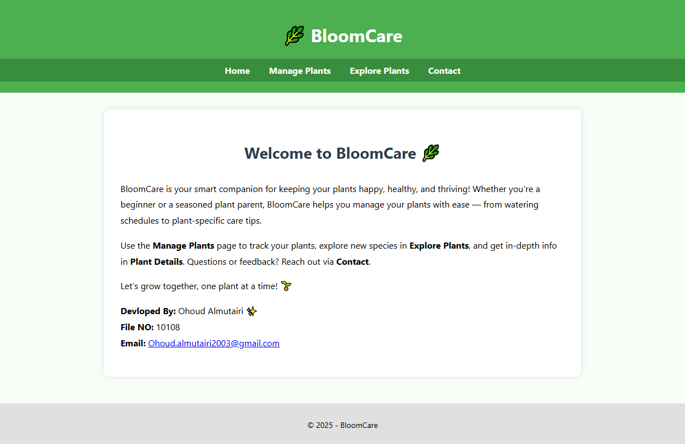
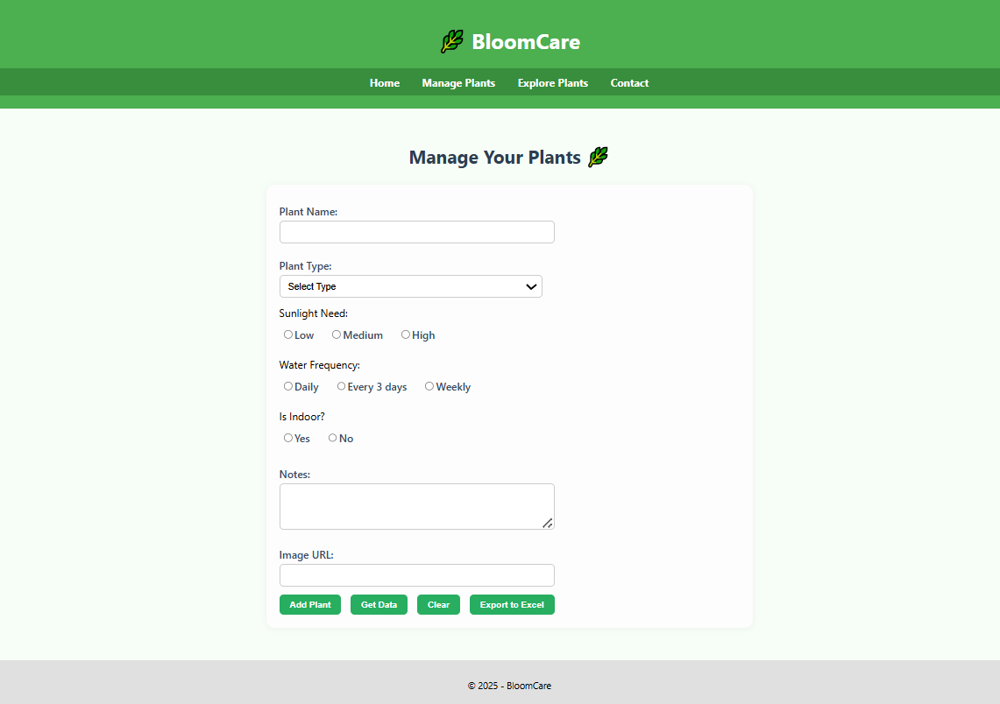
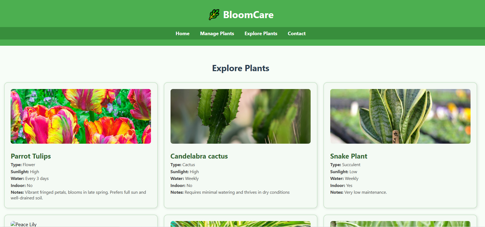
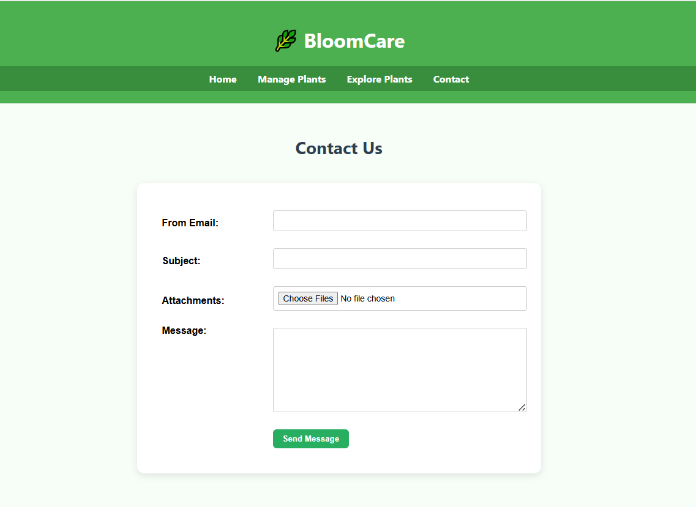

# 🌿 BloomCare – Plant Care Web App

Welcome to **BloomCare**, a web-based plant care management system that helps users add, manage, and explore a variety of plants along with their care details. 
Built with **ASP.NET Web Forms** and **SQL Server**, this application is perfect for plant lovers, hobbyists, or nursery managers who want a simple yet efficient tool 
to care for their greenery.

---

## 💡 Features

✨ **Manage Plants Easily**  
- Add, edit, and delete plant records  
- Assign plant type, sunlight needs, water frequency, and indoor status  
- Clean and user-friendly form design  

🧾 **GridView Management**  
- Display plant data in a styled GridView  
- Edit/Delete actions with visual feedback  
- Export plant records to Excel  

🔍 **Explore Plants**  
- Browse plant details and care instructions in a structured view  
- Discover sunlight and water preferences for each plant  

📬 **Contact Page**  
- Send feedback or inquiries directly via email  
- Server-side and client-side validation  

🧱 **Backend Integration**  
- Uses **SQL Server** with two tables: `plantTypes` and `plants`  
- Implements CRUD operations using a custom `CRUD.cs` helper class  
- Email functionality via `mailMgr.cs`

🎨 **Custom UI without Bootstrap**  
- Styled with custom CSS (`siteStyle.css`)  
- Clean layout using Master Page for consistent header, footer, and navigation bar  

---

## 📸 Screenshots
### 🌿 Home Page

### 🧾 Manage Plants

### 🔍 Explore Plants

### 📬 Contact Page

